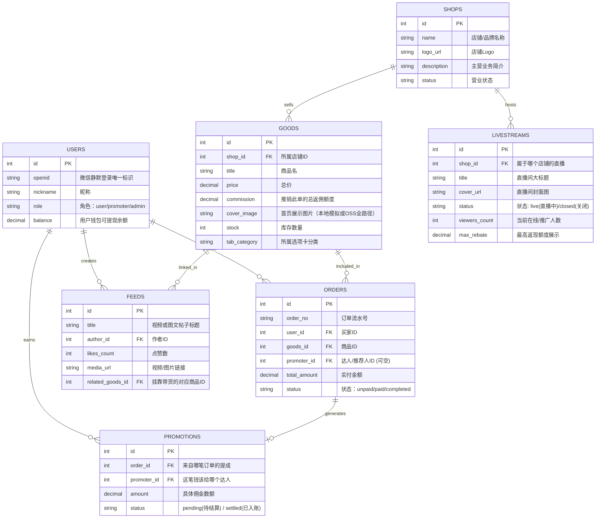

# 本地研发阶段：数据库 ER 架构图与字段详细说明

> **【当前开发环境申明】**
> 因暂无线上公网资源（没钱租网上的服务器），当前此全套数据库仅存储于**本地 Node 环境自带的 MySQL 服务中** (`host: 127.0.0.1`, `port: 3306`, `database: community_db`)。
> 此结构专为当前 10 万以内用户体量的高性价比打法设计。待后期甲方结算项目款后，只需将此本地库的数据整体 Dump (导出 SQL) 并在阿里云或腾讯云 RDS/PolarDB 实例上恢复即可，**代码层面几乎无需改动**。

---

## 整体 ER 架构图 (Entity-Relationship)

---

## 各核心表数据结构与调用方式

### 1. `Users` (用户表)
- **含义**：支撑整个小程序的身份地基，无论是买东西、发帖子、还是赚提成，都要依赖此处注册过的用户记录。
- **存储**：
  - `openid`：微信 `wx.login()` 拿到的用户独占身份证签发。
  - `role`：分为普通消费者（user）、达人推广员（promoter）和最高权限管理员（admin）。
  - `balance`：存储达人们通过推广商品所积攒的，能直接提现到微信零钱的“真金白银”。
- **调用逻辑**：
  在 Node.js 中使用类似于 `const user = await User.findOne({ where: { openid: req.body.openid } })` 判定其是否存在。

### 2. `Shops` (店铺/品牌表) [新增]
- **含义**：管理平台上的各个入驻商家、品牌专卖店或地方特产馆。
- **存储**：记录店名 `name` 和招牌图片 `logo_url`。
- **关联**：它是 `Goods` (商品) 和 `LiveStreams` (直播间) 的父亲。一个店铺可以挂载无数个商品，也可以开启自己的专属直播间。

### 3. `LiveStreams` (直播间表) [新增]
- **含义**：首页“热推直播间”和“当地特产直播间”的数据源。
- **存储**：
  - `status`：控制直播间右上角是飘红色的“直播中”图标还是灰色的“关闭”状态。
  - `max_rebate`：用于在首页直观引诱推销员的“最高返现 ￥XX”诱饵字幕。
- **调用逻辑**：
  `LiveStream.findAll({ include: ['shop'], where: { status: 'live' } })` 拉取所有正在营业的直播间连带其店铺 Logo 渲染首页。

### 4. `Goods` (商品全貌表)
- **含义**：首页那永远滑不到底的瀑布流、分类列表和详情页的所有内容都在这张表里。
- **存储**：
  - `shop_id`：指明这个商品是哪个店铺发货的。
  - `tab_category`：存储“高佣推荐”、“健康食品”等分类词，首页点击时就以此字段为查询条件过滤。
  - `commission`：重点字段！预设好如果该商品被别人推荐购买了，系统要支出多少返佣。
- **调用逻辑**：
  `const list = await Good.findAll({ where: { tab_category: '高佣推荐' }, limit: 10, offset: 0 })`

### 5. `Orders` (订单流水表)
- **含义**：用户的下单动作凭证。
- **存储**：
  - 除了记录 `买家 user_id` 和 `货物 goods_id`，最精妙的是加入了 `promoter_id`（是谁分享的链接）。
  - `status`：控制当前订单处于结账、发货还是售后完成的何种生命阶段。
- **调用逻辑**：
  利用跨表连带查询查出用户订单：`Order.findAll({ include: [{ model: Good, as: 'good' }] })`

### 6. `Promotions` (分佣收益明细日志表)
- **含义**：达人佣金结算池子，专门记录“什么订单”给“谁”产生了“多少钱”的日志流水，以保证对账不出错。
- **存储**：
  - 为什么不能直接加钱进 `Users.balance`？因为如果发生退款，就需要把这笔钱扣回。利用 `pending` 状态控制，只有过了 7 天无理由退款期，才将此笔记录变为 `settled`，同时加钱进余额。

### 7. `Feeds` (达人视频种草流)
- **含义**：即您提到的小程序里的“热门带货视频”或未来想要扩充的如小红书般的图文帖。
- **存储**：
  - `media_url`：存图片或视频的最终访问链接。
  - `related_goods_id`：精髓！这是挂在这条视频左下角那个商品链接的唯一 ID，它直通 `Goods` 表的商品进行购买。
- **调用逻辑**：
  `Feed.findAll({ include: ['author', 'related_goods'] })` 获取该视频的主人和带货商品信息返回给前端。
