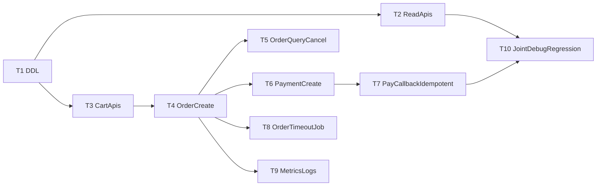

# 本地集市店铺化后端开发任务拆分表（Node）

## 1. 目标

将“本地集市店铺化”后端工作拆解为可直接分配的研发任务，支持并行开发与阶段验收。

范围基于以下文档：
- `doc/本地集市店铺化_框架与实施方案.md`
- `doc/本地集市店铺化_后端需求(Node).md`
- `doc/本地集市店铺化_前后端联调测试用例.md`

## 2. 角色建议

- `BE-1`：交易主程（订单/支付/幂等）
- `BE-2`：基础域开发（店铺/商品/购物车）
- `BE-3`：平台支持（SQL迁移、监控、压测与发布）
- `QA`：联调用例执行与回归

> 若只有 1~2 名后端，可按“优先级”顺序串行推进。

## 3. 总体排期（建议 10~12 人天）

- 第 1-2 天：DDL + 读链路接口
- 第 3-5 天：购物车 + 下单
- 第 6-8 天：支付创建 + 回调幂等
- 第 9-10 天：联调修复 + 稳定性
- 预留 1-2 天：风险缓冲与回归

## 4. 任务拆分（可直接派单）

## T1. 数据库迁移脚本与索引
- **负责人**：`BE-3`
- **工作量**：`1.5 人天`
- **前置依赖**：无
- **输入**：后端需求文档 DDL 草案
- **输出**：
  - SQL 迁移脚本（建表/索引）
  - 回滚脚本（drop 或结构回退）
  - 字段字典（简版）
- **验收标准**：
  - 7 张核心表建成（shops/categories/goods/cart/orders/order_items/pay_transactions）
  - 关键索引可命中（列表、订单查询、支付流水）

## T2. 店铺与商品只读接口
- **负责人**：`BE-2`
- **工作量**：`1.5 人天`
- **前置依赖**：T1
- **接口**：
  - `GET /api/v1/market/shops`
  - `GET /api/v1/market/shops/:shopId`
  - `GET /api/v1/market/shops/:shopId/categories`
  - `GET /api/v1/market/shops/:shopId/goods`
  - `GET /api/v1/market/goods/:goodsId`
- **输出**：
  - Controller + Service + Repository
  - 接口自测记录
- **验收标准**：
  - 支持分页、分类筛选、排序
  - 仅返回有效/上架商品
  - 返回结构统一 `code/msg/data`

## T3. 购物车接口（登录态）
- **负责人**：`BE-2`
- **工作量**：`1.5 人天`
- **前置依赖**：T1
- **接口**：
  - `GET /api/v1/market/cart`
  - `POST /api/v1/market/cart/items`
  - `PUT /api/v1/market/cart/items/:itemId`
  - `DELETE /api/v1/market/cart/items/:itemId`
  - `DELETE /api/v1/market/cart`
- **输出**：
  - 购物车 CRUD 完整链路
  - 用户与店铺隔离校验
- **验收标准**：
  - 同商品重复添加为累加
  - 跨店购物车隔离
  - 越权访问被拦截

## T4. 预结算与创建订单（事务）
- **负责人**：`BE-1`
- **工作量**：`2 人天`
- **前置依赖**：T1、T3
- **接口**：
  - `POST /api/v1/market/orders/preview`
  - `POST /api/v1/market/orders`
- **输出**：
  - 价格校验、库存校验、起送价校验
  - 订单主表 + 明细快照写入
  - 扣库存事务
- **验收标准**：
  - 订单创建失败时库存回滚
  - 返回 `order_no`、`pending_payment`
  - 支持 `idempotency_key`

## T5. 订单查询与取消
- **负责人**：`BE-1`
- **工作量**：`1 人天`
- **前置依赖**：T4
- **接口**：
  - `GET /api/v1/market/orders/my`
  - `GET /api/v1/market/orders/:orderNo`
  - `POST /api/v1/market/orders/:orderNo/cancel`
- **输出**：
  - 我的订单分页与状态筛选
  - 订单详情聚合
  - 取消订单与库存回补
- **验收标准**：
  - 已支付订单不可取消
  - 取消仅限订单归属用户

## T6. 支付创建接口
- **负责人**：`BE-1`
- **工作量**：`1 人天`
- **前置依赖**：T4
- **接口**：
  - `POST /api/v1/market/payments/create`
  - `GET /api/v1/market/payments/status`
- **输出**：
  - 支付单创建
  - 支付状态查询
  - 支付流水初始记录
- **验收标准**：
  - 非 `pending_payment` 订单不可创建支付
  - `out_trade_no` 唯一

## T7. 支付回调与幂等处理
- **负责人**：`BE-1`
- **工作量**：`1.5 人天`
- **前置依赖**：T6
- **接口**：
  - `POST /api/v1/market/pay/callback`
- **输出**：
  - 验签逻辑
  - 回调落库（`notify_raw/notify_count/last_notify_at`）
  - 幂等更新订单与支付状态
- **验收标准**：
  - 重复回调不重复入账
  - 验签失败不改业务状态
  - 正确返回平台期望应答

## T8. 订单超时关闭任务
- **负责人**：`BE-3`
- **工作量**：`0.5 人天`
- **前置依赖**：T4
- **输出**：
  - 定时任务（扫描待支付超时订单）
  - 自动关单 + 库存回补
- **验收标准**：
  - 仅处理未支付订单
  - 幂等执行，不重复回补

## T9. 日志、监控、告警
- **负责人**：`BE-3`
- **工作量**：`0.5 人天`
- **前置依赖**：T4、T7
- **输出**：
  - 关键日志点（下单、支付创建、回调、异常）
  - 监控指标（下单成功率、回调失败率、库存扣减失败率）
- **验收标准**：
  - 能按 `order_no/out_trade_no` 检索全链路日志

## T10. 联调修复与回归支持
- **负责人**：`BE-1 + BE-2 + QA`
- **工作量**：`1.5 人天`
- **前置依赖**：T2~T9
- **输入**：联调测试用例文档
- **输出**：
  - 缺陷修复清单
  - 回归结果记录
- **验收标准**：
  - 核心链路全绿：浏览→加购→下单→支付→订单完成

## 5. 并行开发建议（甘特简版）

## 6. 环境与发布清单

## 6.1 环境变量
- `JWT_SECRET`
- `MYSQL_*`
- `WECHAT_PAY_*`（商户号、证书、密钥）
- `PAY_CALLBACK_SECRET`

## 6.2 发布前检查
- DDL 执行成功并备份
- 回调公网地址可达
- 回调验签在测试环境验证通过
- 关键接口压测通过（至少 50~100 并发下无明显错误）

## 7. 风险与应对

- **库存超卖风险**：下单扣库存必须原子更新 + 事务。
- **重复回调风险**：唯一键 + 幂等短路。
- **状态错乱风险**：严格状态机流转校验。
- **线上回滚风险**：先灰度、可快速关闭新入口，保留旧展示逻辑兜底。

## 8. 派单模板（建议复制到任务系统）

- 标题：`[本地集市][后端][T4] 预结算与创建订单`
- 描述：
  - 背景：
  - 接口：
  - 表结构：
  - 验收标准：
  - 联调人：
  - 截止日期：
