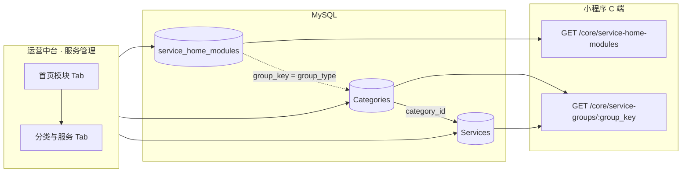

# 九州社区运营中台 · 服务管理

本文档说明运营后台「**服务管理**」页面的产品定位、数据模型、与小程序 C 端的同步关系，以及全部相关 HTTP 接口。

---

## 1. 功能定位

| 项目 | 说明 |
|------|------|
| 后台入口 | 侧栏「首页」→ **服务管理**（路由 `/service-home-manage`） |
| 前端页面 | `admin/src/views/ServiceHomeManage.vue` |
| 作用 | 配置小程序 **首页 Tab「服务」** 的九宫格入口，以及每个入口下的 **分类 Tab + 服务列表** |
| 与「首页管理」区别 | **首页管理**（`/home-display-config`）管的是首页 **运营位**（推荐技工/服务/服务商）；**服务管理**管的是 **分组业务页**（如除螨、家修），二者数据表不同 |

---

## 2. 设计思路（三层模型）

小程序「服务」业务采用统一链路：

```text
首页模块（九宫格）  →  子分类（Tab）  →  服务项目（卡片/列表）
     group_key              Categories.group_type = group_key
                            Services.category_id → Categories.id
```

### 2.1 核心约定：`group_key`

- **模块唯一标识**：`group_key`（小写英文 + 数字 + 下划线，须以小写字母开头，如 `mite_remove`）。
- **关联字段**：分类表使用 `Categories.group_type`，其值 **等于** 对应模块的 `group_key`。
- **中台与 C 端共用**：运营后台改的是 `Categories` / `Services`；小程序通过 C 端接口读同一张表，**无需二次同步**。

### 2.2 三张表职责

| 表名 | 模型 | 职责 |
|------|------|------|
| `service_home_modules` | `ServiceHomeModule` | 九宫格：标题、图标、`group_key`、计价单位、排序、是否启用 |
| `Categories` | `Category` | 分组页顶部 Tab：名称、图标、`group_type`（= `group_key`）、排序 |
| `Services` | `Service` | 具体服务项：标题、价格、封面、描述、上架状态、所属 `category_id` |

### 2.3 数据流示意



### 2.4 C 端可见性规则

- **模块列表**：仅 `service_home_modules.is_active = 1` 的模块出现在九宫格（`GET /core/service-home-modules`）。
- **分组页**：`GET /core/service-groups/:group_key` 会校验模块是否存在且启用（或命中代码内九大分组兜底）；分类按 `sort_order` 排序；服务仅返回 **已上架**（`is_published` 为 `1` / `true` / `NULL`）。
- **下架**：后台「下架」调用 `DELETE /admin/service-home/services/:id`，实为将 `is_published` 置 `0`，不物理删行。

---

## 3. 运营后台页面结构

路径：`/service-home-manage`（`admin/src/router/index.js`）

### Tab 1：首页模块

维护 `service_home_modules`：新增/编辑/删除九宫格入口。

| 字段 | 说明 |
|------|------|
| `group_key` | 创建后不可改（编辑接口不接收修改） |
| `title` | 分组页标题、九宫格文案 |
| `price_unit` | 计价单位展示，如「次」「份」 |
| `icon_url` | 九宫格图标，可填 URL 或上传至 `/api/v1/upload` |
| `sort_order` | 越小越靠前 |
| `is_active` | 是否对 C 端展示 |

### Tab 2：分类与服务

先选择 **当前模块**（`group_key`），再分别维护：

1. **子分类（Tab）** → `Categories`（`group_type = 当前 group_key`）
2. **服务项目** → `Services`（`category_id` 指向上述分类）

图片上传统一走：`POST /api/v1/upload`（字段名 `file`），返回 `data.url` 如 `/uploads/xxx.jpg`；静态资源通过 `GET /uploads/{filename}` 访问。

---

## 4. 鉴权

所有 **管理端** 接口前缀：

```http
/api/v1/admin/service-home/...
```

要求请求头：

```http
Authorization: Bearer <admin_jwt>
```

JWT 须由 `POST /api/v1/auth/admin/login` 签发，且 payload 含 `admin: true`（见 `adminAuthMiddleware`）。

**C 端** `GET /api/v1/core/...` **无需** 管理员 Token。

### 管理端响应格式

控制器统一使用：

```json
{ "errno": 0, "data": ... }
```

失败时：

```json
{ "errno": 400, "errmsg": "错误说明" }
```

（HTTP 状态码多为 200；部分 404 场景为 404。）

前端 `admin/src/utils/request.js` 的 `baseURL` 默认为 `/api/v1`，故页面内写 `/admin/service-home/modules` 即完整路径 `/api/v1/admin/service-home/modules`。

### C 端响应格式

```json
{ "errno": 0, "data": ... }
```

---

## 5. 管理端接口清单

实现文件：

- 路由：`backend/src/routes/adminRoutes.js`（挂载于 `app.use('/api/v1/admin', ...)`）
- 控制器：`backend/src/controllers/adminServiceHomeController.js`

### 5.1 首页模块

| 方法 | 路径 | 说明 |
|------|------|------|
| GET | `/api/v1/admin/service-home/modules` | 模块列表，按 `sort_order`、`id` 升序 |
| POST | `/api/v1/admin/service-home/modules` | 新增模块 |
| PUT | `/api/v1/admin/service-home/modules/:id` | 更新模块（不可改 `group_key`） |
| DELETE | `/api/v1/admin/service-home/modules/:id` | 删除模块（**不**级联删分类/服务） |

**POST Body 示例**

```json
{
  "group_key": "mite_remove",
  "title": "除螨服务",
  "price_unit": "次",
  "icon_url": "/uploads/xxx.png",
  "sort_order": 50,
  "is_active": 1
}
```

**校验**

- `group_key`：正则 `^[a-z][a-z0-9_]{0,62}$`，全局唯一
- `title`：必填

**GET 响应 `data` 元素示例**

```json
{
  "id": 5,
  "group_key": "mite_remove",
  "title": "除螨服务",
  "price_unit": "次",
  "icon_url": null,
  "sort_order": 50,
  "is_active": 1,
  "createdAt": "2026-05-18T13:43:02.000Z",
  "updatedAt": "2026-05-18T13:43:02.000Z"
}
```

---

### 5.2 子分类（Tab）

| 方法 | 路径 | 说明 |
|------|------|------|
| GET | `/api/v1/admin/service-home/categories?group_key={gk}` | 某模块下全部分类 |
| POST | `/api/v1/admin/service-home/categories` | 新增分类 |
| PUT | `/api/v1/admin/service-home/categories/:id` | 更新分类 |
| DELETE | `/api/v1/admin/service-home/categories/:id` | 删除分类（分类下仍有服务则拒绝） |

**POST Body 示例**

```json
{
  "group_key": "mite_remove",
  "name": "床垫除螨",
  "icon_url": "/img/index/menuicon2.png",
  "sort_order": 2
}
```

**GET Query**

| 参数 | 必填 | 说明 |
|------|------|------|
| `group_key` | 是 | 与模块 `group_key` 一致 |

---

### 5.3 服务项目

| 方法 | 路径 | 说明 |
|------|------|------|
| GET | `/api/v1/admin/service-home/services?group_key={gk}` | 某模块下全部服务（含 `category` 关联） |
| POST | `/api/v1/admin/service-home/services` | 新增服务 |
| PUT | `/api/v1/admin/service-home/services/:id` | 更新服务 |
| DELETE | `/api/v1/admin/service-home/services/:id` | **下架**（`is_published = 0`） |

**POST Body 示例**

```json
{
  "category_id": 57,
  "title": "床垫深度除螨杀菌【1小时】",
  "price": 188,
  "cover_image": "https://example.com/cover.jpg",
  "description": "床垫深度除螨杀菌【1小时】",
  "is_published": 1,
  "sales_count": 0
}
```

**GET 逻辑**

1. 按 `group_key` 查 `Categories`（`group_type = group_key`）
2. 再查 `Services.category_id IN (...)`，附带 `category: { id, name, group_type }`

---

### 5.4 图片上传（共用）

| 方法 | 路径 | 说明 |
|------|------|------|
| POST | `/api/v1/upload` | `multipart/form-data`，字段 `file` |

**成功响应**（注意为 `code` 而非 `errno`，前端已兼容）：

```json
{
  "code": 0,
  "msg": "ok",
  "data": {
    "url": "/uploads/1738123456789-abc.jpg",
    "size": 102400,
    "mime_type": "image/jpeg",
    "width": 800,
    "height": 600
  }
}
```

---

## 6. 小程序 C 端接口

实现：`backend/src/controllers/coreDataController.js`  
路由：`backend/src/routes/coreDataRoutes.js` → 前缀 `/api/v1/core`

### 6.1 九宫格模块列表

```http
GET /api/v1/core/service-home-modules
```

**响应 `data`**：数组，元素字段：

| 字段 | 说明 |
|------|------|
| `group_key` | 模块 key |
| `title` | 标题 |
| `icon_url` | 图标（可 null） |
| `price_unit` | 计价单位 |
| `sort_order` | 排序 |

若表为空，回退代码内预设九大分组元数据（`SERVICE_GROUP_KEYS` / `GROUP_META`）。

---

### 6.2 分组页（分类 + 服务）

```http
GET /api/v1/core/service-groups/:group
```

`:group` 即 `group_key`（如 `mite_remove`）。

**响应 `data` 示例**

```json
{
  "title": "除螨服务",
  "price_unit": "次",
  "categories": [
    { "name": "热门服务", "icon_url": "/img/index/menuicon1.png", "sort_order": 1 }
  ],
  "services": [
    {
      "id": 120,
      "title": "床垫深度除螨杀菌【1小时】",
      "price": 188,
      "cover_image": "https://...",
      "sales_count": 0,
      "category": { "name": "床垫除螨" }
    }
  ]
}
```

**说明**

- `categories` 不含 `id`（C 端展示用）；管理端表格需用 admin 接口拿 `id`。
- `services` 仅 **已上架**；按 `sales_count` 降序、`id` 升序。
- 无效或未启用的 `group_key` 返回 `errno` 非 0（如 400）。

---

### 6.3 其它相关 C 端接口（只读）

| 接口 | 用途 |
|------|------|
| `GET /api/v1/core/services/:id` | 服务详情（含描述、详情图等） |
| `GET /api/v1/core/services` | 分页服务列表 |
| `GET /api/v1/core/categories/:categoryId/services` | 按分类 ID 拉服务 |

到家下单时可在订单 body 传 `group_key`，与模块白名单校验相关，见 `serviceOrderController` / `doc/前端对接_到家服务订单与九州派单.md`。

---

## 7. 内置 `group_key` 参考

迁移种子与代码兜底中的九大模块：

| group_key | 默认标题 | 计价单位 |
|-----------|----------|----------|
| `tidy` | 整理收纳 | 份 |
| `urgent_fix` | 家修急事 | 次 |
| `appliance_clean` | 家电清洗 | 次 |
| `pioneer_clean` | 开荒保洁 | 次 |
| `mite_remove` | 除螨服务 | 次 |
| `furniture_care` | 家具养护 | 次 |
| `baby_home` | 宝宝家事 | 次 |
| `house_repair` | 房屋修缮 | 次 |
| `beauty_home` | 上门美业 | 次 |

可在中台 **新增模块** 扩展任意合法 `group_key`，再在「分类与服务」中补数据。

---

## 8. 部署与初始化

### 8.1 建表（模块元数据）

```bash
cd backend
npm run migrate:service-home
```

等价执行迁移：`src/migrations/20260518120000-create-service-home-modules.js`（建表并写入九大模块种子）。

### 8.2 补全分类与服务演示数据

模块表有数据 **不等于** 分类/服务有数据；需执行：

```bash
cd backend
node seed_service_groups.js
```

脚本按 `group_key` 幂等写入 `Categories`（`group_type`）与 `Services`，已存在则跳过或更新价格/封面。

### 8.3 后端热更新

修改 `adminRoutes.js` 或控制器后需 **重启** Node 进程，否则新路由会 404。

### 8.4 常见问题

| 现象 | 原因 | 处理 |
|------|------|------|
| 中台「分类与服务」全空 | 仅建了 `service_home_modules`，未 seed 分类/服务 | 执行 `node seed_service_groups.js` |
| 接口 404 `Cannot GET .../service-home/...` | 后端未重启 | 重启 `node src/index.js` |
| C 端有模块名但列表空 | 该 `group_key` 下无分类或服务均未上架 | 在中台补数据或检查 `is_published` |
| 上传成功但页面报失败 | 上传接口返回 `code:0`，部分旧代码只认 `errno` | 当前 `ServiceHomeManage.vue` 已兼容两种格式 |

---

## 9. 前端调用对照（运营中台）

| 页面操作 | 请求 |
|----------|------|
| 加载模块列表 | `GET /admin/service-home/modules` |
| 保存模块 | `POST` 或 `PUT /admin/service-home/modules/:id` |
| 删除模块 | `DELETE /admin/service-home/modules/:id` |
| 切换模块后加载分类 | `GET /admin/service-home/categories?group_key=` |
| 保存分类 | `POST` 或 `PUT /admin/service-home/categories/:id` |
| 加载服务 | `GET /admin/service-home/services?group_key=` |
| 保存服务 | `POST` 或 `PUT /admin/service-home/services/:id` |
| 下架服务 | `DELETE /admin/service-home/services/:id` |
| 上传图标/封面 | `POST /api/v1/upload` |

---

## 10. 扩展与约束

1. **删除模块** 不会删除历史 `Categories` / `Services`；重新创建同 `group_key` 模块后，旧分类数据仍可通过 `group_type` 关联显示。
2. **新建模块** 后必须在「分类与服务」Tab 维护分类与服务，C 端分组页才会有内容。
3. **服务商直约服务**（`service_provider_profiles` / 服务商后台维护）与本「首页分组服务」是不同产品线；本模块面向平台统一 SKU 列表（`Services` 表）。
4. 生产环境请配置强密码并关闭 `DEBUG_ADMIN_LOGIN`，避免跳过管理员登录校验。

---

## 11. 相关文件索引

| 类型 | 路径 |
|------|------|
| 后台页面 | `admin/src/views/ServiceHomeManage.vue` |
| 后台路由 | `admin/src/router/index.js` |
| 管理 API 路由 | `backend/src/routes/adminRoutes.js` |
| 管理 API 实现 | `backend/src/controllers/adminServiceHomeController.js` |
| C 端 API 实现 | `backend/src/controllers/coreDataController.js` |
| 模块模型 | `backend/src/models/serviceHomeModule.js` |
| 分类/服务模型 | `backend/src/models/category.js`、`backend/src/models/service.js` |
| 模块迁移 | `backend/src/migrations/20260518120000-create-service-home-modules.js` |
| 分类服务种子 | `backend/seed_service_groups.js` |
| 订单对接说明 | `doc/前端对接_到家服务订单与九州派单.md` |
