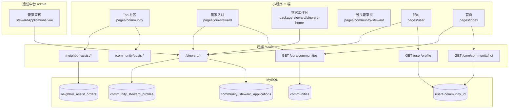

# 九州社区 · 社区模块前后端功能实现

本文档基于当前仓库中的**小程序 C 端**、**Node 后端**（`backend/src/app.js` → `routes/index.js`）与**运营中台**，说明「社区」相关功能的实现现状、数据模型、接口约定与用户流程。

> **概念区分**
>
> | 术语 | 含义 |
> |------|------|
> | **社区 Tab** | 小程序底部 Tab「社区」，含话题/活动帖子、邻里帮帮互动 |
> | **小区（`community_id`）** | 业务隔离维度：技工、热卖榜、帮帮订单、服务订单等按小区过滤 |
> | **小区管家（Steward）** | 独立角色：入驻审核 → 管家工作台 → 居民服务热线页 |

---

## 1. 模块总览



### 1.1 实现度一览

| 能力 | 后端 | 小程序 | 中台 | 说明 |
|------|------|--------|------|------|
| 小区主数据列表 | ✅ | ✅ | — | `GET /core/communities` |
| 小区维度热卖榜 | ✅ | ✅ | — | `GET /core/community/hot` |
| 邻里帮帮（同小区池） | ✅ | ✅ | — | `community-pool` / `community-grab` |
| 小区管家入驻/审核 | ✅ | ✅ | ✅ | 完整链路已 E2E 验证 |
| 社区帖子（话题/活动） | ⚠️ 501 | ✅ 已写 UI | — | 路径与实现均未对齐 |
| 用户绑定/修改小区 | ⚠️ | ⚠️ | — | 仅有 `users.community_id` 读取，无 PATCH |
| 中台小区 CRUD | ❌ | — | ❌ | 路由/页面未实现 |
| `geo/communities` | ❌ | 有 fallback | — | 前端 fallback 到 `core/communities` |

---

## 2. 数据模型

### 2.1 表结构

#### `communities` — 小区主数据

迁移：`backend/sql/0428_create_communities.sql`

| 字段 | 类型 | 说明 |
|------|------|------|
| `id` | BIGINT PK | 小区 ID |
| `name` | VARCHAR(100) | 小区名称 |
| `address` | VARCHAR(255) | 地址 |
| `latitude` / `longitude` | DECIMAL | 坐标（可选） |
| `sort_order` | INT | 排序 |
| `status` | VARCHAR(20) | `active` / `inactive` |

Sequelize 模型：`backend/src/modules/core/models/Community.js`

#### `community_steward_applications` — 管家入驻申请

迁移：`backend/sql/0430_community_steward.sql`

| 字段 | 说明 |
|------|------|
| `user_id` | UNIQUE，每用户一条申请 |
| `community_id` | 可选，当前小程序多传 `community_name` |
| `community_name` | 服务社区名称（必填） |
| `name`, `phone`, `gender`, `id_card`, `id_card_url`, `intro` | 申请资料 |
| `status` | `pending` / `approved` / `rejected` |
| `reject_reason`, `reviewed_by`, `reviewed_at` | 审核信息 |

模型：`backend/src/modules/steward/models/CommunityStewardApplication.js`

#### `community_steward_profiles` — 管家档案

审核通过后 upsert；居民侧/工作台展示社区名、热线等。

| 字段 | 说明 |
|------|------|
| `user_id` | UNIQUE |
| `community_id`, `community_name` | 服务小区 |
| `name`, `phone`, `hotline` | 展示信息 |
| `status` | 默认 `active` |

模型：`backend/src/modules/steward/models/CommunityStewardProfile.js`

#### 关联字段

| 表/模型 | 字段 | 用途 |
|---------|------|------|
| `users` | `community_id` | 用户默认小区；帮帮池、热卖榜、技工列表过滤 |
| `users` | `steward_status` | 可选列；审核时同步，profile 亦查申请表 |
| `neighbor_assist_orders` | `community_id` | 帮帮单归属小区 |
| `service_orders` | `community_id` | 到家服务订单归属小区 |

---

## 3. 后端 API

**统一前缀**：`/api/v1`  
**标准入口**：`node backend/src/app.js`（模块化路由 `backend/src/routes/index.js`）

> 另存在 `backend/src/index.js` 遗留入口（120 生产环境使用），挂载面更广，部分路由文件不在本仓库；社区核心能力以模块化实现为准。

### 3.1 小区列表

#### `GET /core/communities`

| 项目 | 说明 |
|------|------|
| 鉴权 | 无 |
| 实现 | `modules/core/controllers/core.controller.js` → `getCommunities` |
| 条件 | `status = 'active'`，按 `sort_order`, `id` 排序 |

**响应示例：**

```json
{
  "success": true,
  "list": [
    { "id": 1, "name": "阳光社区", "address": "杭州市西湖区阳光路1号" }
  ]
}
```

**前端调用约定：**

- 入驻页（管家/技工/商家/服务商）优先 `GET geo/communities`，失败则 fallback 本接口。
- 当前 **`/geo/communities` 未在模块化入口实现**，生产需 alias 或统一改前端路径。

---

### 3.2 小区维度热卖榜

#### `GET /core/community/hot`

| 项目 | 说明 |
|------|------|
| 鉴权 | 可选 JWT（`optionalAuthMiddleware`） |
| 实现 | `controllers/coreDataController.js` → `getCommunityHot` |
| Query | `community_id`（必填，或登录用户带 `users.community_id`）、`days`（默认 30）、`limit`（默认 10）、`type`（`service` / `shop` / `all`） |

**逻辑：** 统计指定小区内 `service_orders` / `market_orders` 销量排行，返回服务与店铺列表。

**小程序页面：** `pages/index/index.js`（首页热卖）、`pages/community-hot-list/community-hot-list.js`

---

### 3.3 小区管家（Steward）

路由：`backend/src/modules/steward/routes.js`  
控制器：`backend/src/modules/steward/controllers/steward.controller.js`  
**全部接口需用户 JWT**（`authMiddleware`）；审核接口额外要求 `req.user.admin === true` 或 `role === 'admin'`。

> **Snowflake 用户 ID**：控制器使用 `resolveUserId()` 将 `req.user.id` 转为 **字符串**，避免 `Number()` 精度丢失导致申请记错用户。

| 方法 | 路径 | 说明 |
|------|------|------|
| POST | `/steward/apply` | 提交/重提入驻申请 |
| GET | `/steward/application/me` | 当前用户申请记录 |
| GET | `/steward/profile/me` | 已通过用户的档案；未通过 → 403 |
| GET | `/steward/applications` | **管理员** 分页列表 |
| POST | `/steward/applications/:id/review` | **管理员** 审核 |

#### POST `/steward/apply`

**请求体：**

```json
{
  "name": "张三",
  "phone": "13800138000",
  "gender": "男",
  "community_name": "阳光社区",
  "community_id": 1,
  "id_card": "3301**********",
  "id_card_url": "/uploads/xxx.jpg",
  "intro": "自我介绍"
}
```

| 校验 | 说明 |
|------|------|
| 必填 | `name`, `phone`, `community_name`（或 `community`） |
| 已通过 | 返回「您已是认证小区管家」 |
| 驳回后重提 | 同 `user_id` 更新为 `pending`，清空驳回原因 |

**审核通过副作用：**

1. `community_steward_profiles` upsert  
2. 尝试更新 `users.steward_status = 'approved'`（列不存在则忽略）

#### GET `/steward/applications`

Query：`status`（`pending`/`approved`/`rejected`）、`page`、`pageSize`

**响应：**

```json
{
  "code": 0,
  "data": {
    "list": [],
    "total": 0,
    "page": 1,
    "pageSize": 20
  }
}
```

#### POST `/steward/applications/:id/review`

**请求体：**

```json
{
  "status": "approved",
  "reject_reason": "资料不完整"
}
```

`reject_reason` 在 `rejected` 时建议填写。

---

### 3.4 邻里帮帮（社区 Tab · 邻里互动）

路由：`backend/src/modules/neighbor-assist/routes.js`  
**全部需 JWT**；响应格式 `{ errno: 0, data }` / `{ errno, errmsg }`。

与「社区 Tab」直接相关的接口：

| 方法 | 路径 | 说明 |
|------|------|------|
| GET | `/neighbor-assist/orders/community-pool` | 本小区帮帮单池（已支付待接单、非本人发布） |
| POST | `/neighbor-assist/orders/:id/community-grab` | 同小区邻居接单（不要求技工身份） |
| POST | `/neighbor-assist/orders` | 发布帮帮单（body 可带 `community_id`，否则取用户默认） |

**community-pool 过滤逻辑：**

- 用户须登录；
- 取 `users.community_id` 作为 `myComm`；
- 条件：`status = paid_pending_dispatch`、`pay_status = paid`、`assigned_worker_id IS NULL`、`user_id != 当前用户`；
- 若 `myComm` 非空，再加 `community_id = myComm`。

**小程序：** `pages/community/community.js` → Tab「邻里互动」调用 `community-pool`；卡片跳转 `neighbor-assist-order-detail`。

---

### 3.5 社区帖子

路由：`backend/src/modules/community/routes.js`  
控制器：`backend/src/modules/community/controllers/post.controller.js`

| 方法 | 路径（模块化） | 状态 |
|------|----------------|------|
| GET | `/community/posts` | **501 占位** |
| GET | `/community/posts/my/published` 等 | **501** |
| POST | `/community/posts` | **501** |
| POST | `/community/posts/:postId/like` | **501** |
| POST | `/community/posts/:postId/comment` | **501** |

**路径不一致（重要）：**

小程序当前调用 **`GET/POST /posts`**（见 `pages/community/community.js`），与模块化路径 **`/community/posts`** 不一致，且 legacy `postRoutes.js` 不在仓库内。  
因此 Tab「热门话题」「热门活动」在现网/本地模块化后端下会加载失败；「邻里互动」因改走帮帮池，可独立可用。

---

### 3.6 用户 Profile 中的社区字段

#### `GET /user/profile`

实现：`backend/src/modules/user/controllers/user.controller.js`

| 返回字段 | 来源 |
|----------|------|
| `community_id` / `communityId` | `users` 表 |
| `steward_status` / `stewardStatus` | `community_steward_applications.status`（`approved` 时为 `approved`，否则原状态或空） |

#### `PATCH /user/profile`

当前返回 **501**，无法在 C 端修改绑定小区。

**生产环境注意：** 120 若仍跑 `index.js` 且挂载旧版 `userController`，profile 可能不含 `steward_status`；需与模块化 `modules/user` 对齐。

---

### 3.7 其他依赖 `community_id` 的接口（首页联动）

| 接口 | 说明 |
|------|------|
| `GET /core/workers` | Query 必填 `community_id`（或登录用户默认小区） |
| `GET /core/workers/:id` | 技工 `community_id` 与请求不一致 → 404 |
| `GET /core/service-providers` | 按档案 `community_id` 过滤 |
| `GET /core/goods/featured` | 前端传 `community_id`；后端当前未必按小区表过滤 |
| `POST /service-orders/` | 下单写入 `community_id`（body 或用户默认） |

---

## 4. 小程序前端

### 4.1 页面与路由（`app.json`）

| 路径 | 类型 | 职责 |
|------|------|------|
| `pages/community/community` | Tab | 社区主页：热门话题 / 热门活动 / 邻里互动 |
| `pages/community-publish/community-publish` | 普通页 | 发帖 |
| `pages/community-hot-list/community-hot-list` | 普通页 | 小区热卖榜 |
| `pages/join-steward/join-steward` | 普通页 | 管家入驻申请 |
| `pages/community-steward/community-steward` | 普通页 | 居民侧管家热线（静态 400 号，未接 API） |
| `package-steward/pages/steward-home/steward-home` | 分包 | 管家工作台 |

**我的 · 社区相关菜单**（`pages/user/user.js` → `communityMenus`）：

- 我的帖子 / 点赞 / 参与话题 → `my-posts`
- 我的关注 → `my-follows`
- 参与活动 / 活动管理 → `my-activities` / `activity-manage`（活动列表多为占位）
- 诉求列表 → `appeal-list`（**本地存储** `user_appeals_v1`，无后端）

### 4.2 社区 Tab 数据流

```
pages/community/community
├── Tab「热门话题」「热门活动」
│     └── GET /posts?category=...          ← 后端未实现 / 路径不一致
├── Tab「邻里互动」
│     └── GET neighbor-assist/orders/community-pool
│     └── 卡片 → neighbor-assist-order-detail
├── 「发帖」→ community-publish → POST /posts
└── 「一键发布」→ order-publish（帮帮发布）
```

**公告条：** 前端写死 + `utils/localPrefs.js` 本地已读标记（`community_announce_read_v1`）。  
**顶部搜索框：** 仅绑定 `communitySearchKeyword`，**未参与接口过滤**。  
**定位按钮：** `wx.chooseLocation` 仅 Toast 展示，**不写回 `community_id`**。

### 4.3 小区 `community_id` 在前端的使用

| 来源 | 说明 |
|------|------|
| 登录/静默登录 | `app.globalData.user.communityId` ← `user.community_id` |
| `GET /user/profile` | `pages/user/user.js`、首页等刷新 |
| `wx.getStorageSync('community_id')` | 部分页面兜底 |

**首页**（`pages/index/index.js`）在以下请求携带 `community_id`：

- `core/community/hot`
- `core/workers`
- `core/goods/featured`
- `core/service-providers`

**无独立「选择绑定小区」页面**；用户默认小区依赖注册/后台数据。

### 4.4 管家入驻与用户中心流程

工具：`utils/rolePortals.js`

```mermaid
stateDiagram-v2
  [*] --> 未申请: steward_status 空
  未申请 --> 待审核: POST /steward/apply
  待审核 --> 已通过: 中台 approve
  待审核 --> 已驳回: 中台 reject
  已驳回 --> 待审核: 重新 apply
  已通过 --> 已通过: 重复 apply 提示已是管家

  未申请 --> 入驻页: goStewardJoin / goStewardPortal
  待审核 --> Toast审核中
  已驳回 --> Modal重新申请 → join-steward
  已通过 --> 管家工作台: navigateToStewardHome
  已通过 --> 居民页: goStewardMenu → community-steward
```

**入口（`pages/user/user.js`）：**

| 入口 | 方法 | 已通过去向 |
|------|------|------------|
| 工作台「小区管家工作台」 | `goStewardPortal` | `package-steward/steward-home` |
| 加入九州社区「小区管家入驻」 | `goStewardJoin` | 同上 |
| 其他服务「小区管家」 | `goStewardMenu` | `pages/community-steward` |

**`canUseStewardPortal` 条件：** `steward_status` 为 `approved` / `active` / `1`，或角色含 `admin`。

### 4.5 管家入驻页

`pages/join-steward/join-steward.js`

| 步骤 | 行为 |
|------|------|
| 加载社区列表 | `GET geo/communities` → 失败则 `GET core/communities`，取 `name` 作 picker |
| 上传证件 | `POST upload` |
| 提交 | `POST steward/apply`，传 **`community_name`**（通常不传 `community_id`） |
| 成功后 | 本地设置 `steward_status = 'pending'` |

### 4.6 管家工作台

`package-steward/pages/steward-home/steward-home.js`

| 接口 | 用途 |
|------|------|
| `GET steward/profile/me` | 展示 `communityName`、`hotline` |

入口：居民服务页、反馈、消息、关于；返回用户 Tab。

### 4.7 关键工具与配置

| 文件 | 作用 |
|------|------|
| `utils/rolePortals.js` | 管家/技工/商家门户判断与跳转 |
| `utils/config.js` | `baseUrl`、`useCuratedHomeHotList`（是否走小区热卖榜） |
| `utils/localPrefs.js` | 社区公告已读 |
| `api/user.js` | `GET /user/profile` |
| `api/neighborAssist.js` | 帮帮单封装（社区页部分直调 `util.get`） |

---

## 5. 运营中台

| 项目 | 说明 |
|------|------|
| 路由 | `/steward-applications`（`admin/src/router/index.js`） |
| 页面 | `admin/src/views/StewardApplications.vue` |
| 鉴权 | `admin_token`（JWT 需含 admin 标识） |

**功能：**

- Tab：待审核 / 已通过 / 已驳回
- 查看详情（含证件照）
- 通过：`POST /steward/applications/:id/review` `{ status: 'approved' }`
- 驳回：弹窗填写 `reject_reason`

**未实现：** 小区 CRUD 页、`communities` 表后台维护、社区帖子 moderation。

---

## 6. 端到端业务流程

### 6.1 小区管家入驻（已实现）

```
1. 用户登录（SMS / 微信）
2. 我的 → 小区管家入驻 → join-steward
3. 选社区名、填资料、上传身份证 → POST /steward/apply
4. 中台 steward-applications 审核
5. 通过 → GET /steward/profile/me 可用；个人中心应显示 steward_status=approved
6. 管家进入 steward-home；居民从「小区管家」进入 community-steward
```

自动化测试脚本：`scripts/_test_steward_e2e.py`（120 环境 20/20 通过）。

### 6.2 社区 Tab · 邻里互动（已实现）

```
1. 用户须登录且 users.community_id 有值
2. Tab 社区 → 邻里互动 → community-pool
3. 点击卡片 → 帮帮详情 → community-grab 接单
```

### 6.3 社区帖子（未打通）

```
1. Tab 热门话题/活动 → GET /posts → 501 或 404
2. 发帖 community-publish → POST /posts → 501
3. 我的帖子 my-posts → 同上
```

---

## 7. 已知缺口与建议

| 优先级 | 问题 | 建议 |
|--------|------|------|
| P0 | 帖子 API 路径 `/posts` vs `/community/posts`，且控制器 501 | 统一路径并实现 post CRUD，或前端改路径 + 接主库 |
| P0 | 120 `/user/profile` 缺 `steward_status` | 部署 `modules/user/controllers/user.controller.js`，ID 用字符串 |
| P1 | `geo/communities` 缺失 | 增加 alias 指向 `getCommunities` |
| P1 | 管家入驻只传 `community_name` | 提交时映射 `community_id`（picker 索引对应 list.id） |
| P1 | `community-steward` 热线写死 | 接 `steward/profile/me` 或按小区配置 |
| P2 | 无 C 端绑定小区 | 实现 `PATCH /user/profile` 的 `community_id` + 选择页 |
| P2 | neighbor-assist / user 仍用 `Number(userId)` | 与 steward 一样改为字符串 ID |
| P2 | 中台小区管理 | 新增 `admin/communities` CRUD |

---

## 8. 相关文件索引

### 后端

| 路径 | 说明 |
|------|------|
| `backend/src/routes/index.js` | 模块化路由挂载 |
| `backend/src/modules/steward/` | 管家模块 |
| `backend/src/modules/core/controllers/core.controller.js` | 小区列表 |
| `backend/src/controllers/coreDataController.js` | 小区热卖、技工过滤 |
| `backend/src/modules/neighbor-assist/` | 邻里帮帮 |
| `backend/src/modules/community/` | 帖子（占位） |
| `backend/src/modules/user/controllers/user.controller.js` | Profile 含 steward_status |
| `backend/sql/0428_create_communities.sql` | 小区表 |
| `backend/sql/0430_community_steward.sql` | 管家表 |

### 小程序

| 路径 | 说明 |
|------|------|
| `pages/community/` | 社区 Tab |
| `pages/join-steward/` | 管家入驻 |
| `pages/community-steward/` | 居民管家页 |
| `package-steward/pages/steward-home/` | 管家工作台 |
| `pages/user/user.js` | 入口与状态路由 |
| `utils/rolePortals.js` | 角色门户 |

### 中台

| 路径 | 说明 |
|------|------|
| `admin/src/views/StewardApplications.vue` | 管家审核 |
| `admin/src/router/index.js` | 路由注册 |

---

## 9. 测试

| 脚本 | 范围 |
|------|------|
| `scripts/_test_steward_e2e.py` | 管家入驻全链路（登录→申请→中台审核→档案→DB） |
| `doc/测试命令/社区小程序全链路测试方案.md` | 社区 Tab 与帮帮 broader 方案 |

**管家 E2E 覆盖点：** 路由挂载、申请校验、待审/驳回/通过、重复申请、DB 一致性、前端静态引用检查。

---

*文档版本：2026-05-19 · 与仓库当前实现同步*
