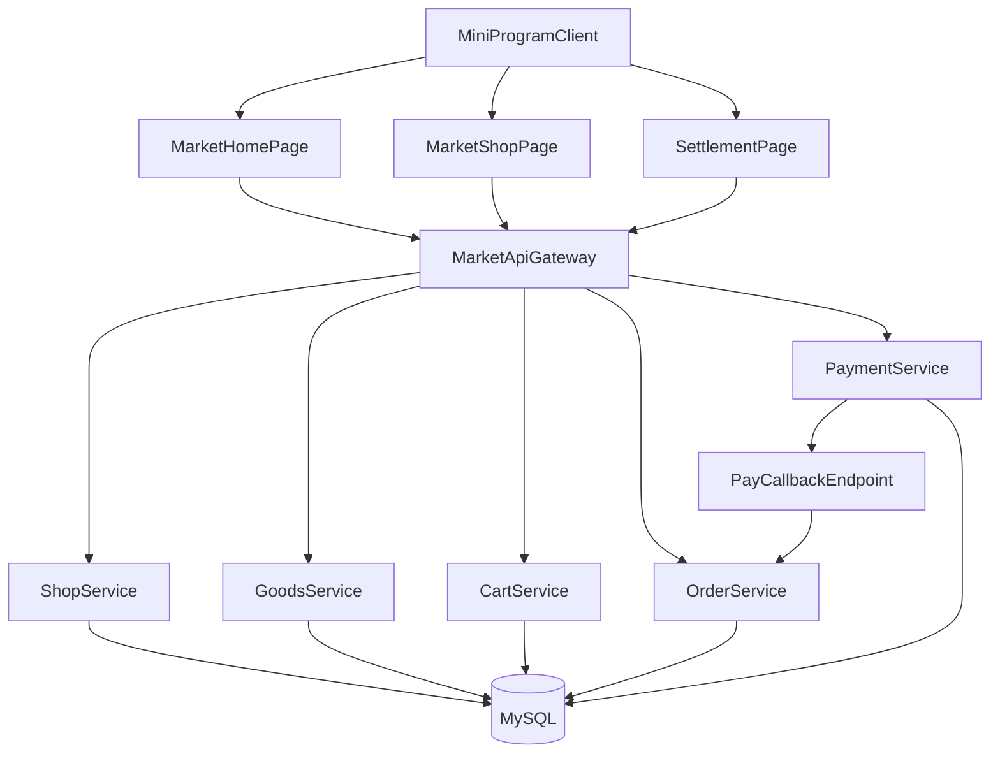
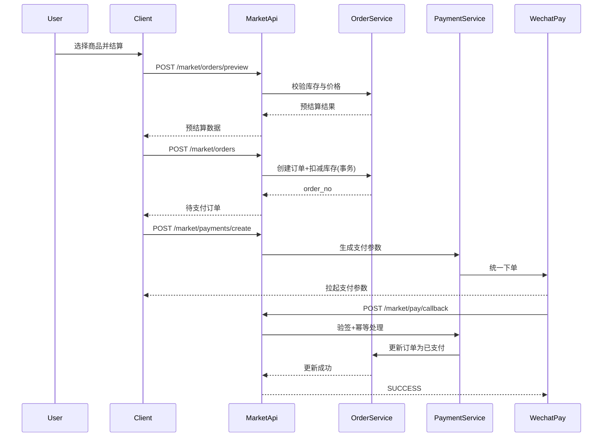

# 本地集市店铺化（对标闪购）框架与实施方案

## 1. 背景与目标

当前“本地集市”已具备页面形态，但核心数据仍以本地 Mock 为主：
- 首页“本地集市”店铺卡片来自 `pages/index/index.js` 中 `allMarketShops`。
- 店铺详情来自 `pages/market-shop/market-shop.js` 中 `SHOP_MAP`。
- 购物车与结算为前端本地状态，未形成服务端交易闭环。

本方案目标是把“本地集市”升级为可运营、可扩展、可联调的店铺系统，能力范围对齐“美团外卖/淘宝闪购”的简化版本，覆盖：
- 店铺列表与筛选
- 店铺详情与商品分类
- 购物车服务端化
- 下单与订单流转
- 支付结果回调与订单状态闭环

## 2. 一期范围（Scope C）

按已确认范围，一期实现完整交易链路：
- 列表 + 详情 + 购物车 + 下单 + 支付回调
- 暂不做复杂营销（满减叠券、拼团、会员价阶梯等）
- 暂不做高级配送调度（骑手轨迹、多仓路由、智能运费引擎）

## 3. 对标产品抽象（闪购简化版）

### 3.1 核心页面能力
- 首页本地集市：分类导航 + 附近店铺流 + 基础筛选（综合、起送价、配送时长）
- 店铺页：左分类右商品、购物车、商家信息、评价占位
- 结算页：地址、配送方式、备注、优惠占位、提交订单
- 订单页：待支付、已支付待履约、已完成、已取消

### 3.2 核心业务能力
- 店铺营业状态判断（营业中、打烊）
- 商品上下架与库存控制
- 购物车持久化（按用户+店铺）
- 订单状态机（创建、支付、取消、完成）
- 支付回调幂等（重复通知不重复入账）

## 4. 总体架构设计

## 5. 领域划分与接口域策略

后端采用独立 `market` 领域接口，不把交易能力混入 `core`：
- 读取域：`/api/v1/market/shops/*`、`/api/v1/market/goods/*`
- 交易域：`/api/v1/market/cart/*`、`/api/v1/market/orders/*`
- 支付域：`/api/v1/market/payments/*`、`/api/v1/market/pay/callback`

统一约定（延续现有文档风格）：
- 统一前缀：`/api/v1`
- 需要登录接口：JWT `Authorization: Bearer <token>`
- 返回结构：`{ code, msg, data }`
- 上传图片继续复用：`POST /api/v1/upload`

## 6. 数据模型框架（一期）

一期建议最小可用模型：
- `market_shops`：店铺主数据（名称、分类、营业状态、配送信息、评分等）
- `market_shop_categories`：店内商品分类
- `market_goods`：商品主数据（价格、原价、库存、上下架、销量）
- `market_cart_items`：购物车项（user_id + shop_id + goods_id + quantity）
- `market_orders`：订单主表（金额、状态、地址快照、备注、支付状态）
- `market_order_items`：订单商品快照（下单时固化价格与名称）
- `market_pay_transactions`：支付交易流水与回调日志

关键设计原则：
- 下单必须写“快照”，避免商品后续改价影响历史订单。
- 购物车按“用户+店铺”隔离，防止跨店混结算。
- 支付回调必须幂等，按 `out_trade_no` 或 `pay_trade_no` 去重。

## 7. 前端改造清单

## 7.1 首页 `本地集市` 改造
- 文件：`pages/index/index.js`、`pages/index/index.wxml`
- 改造点：
  - `allMarketShops` 替换为店铺列表接口返回。
  - `marketTopCats` 与后端店铺分类字典对齐。
  - 增加分页与下拉刷新，保留“综合排序/筛选”交互入口。

## 7.2 店铺页改造
- 文件：`pages/market-shop/market-shop.js`、`pages/market-shop/market-shop.wxml`
- 改造点：
  - `SHOP_MAP` 替换为店铺详情 + 分类 + 商品接口。
  - 左右联动保留，数据来源改为 API。
  - 加减购改为调用购物车接口（而非本地对象直接累计）。

## 7.3 结算与订单联动
- 已有结算跳转可保留，新增：
  - “确认订单”前先拉服务端购物车最新状态。
  - 提交订单后返回 `order_no`，拉起支付。
  - 支付结果页轮询订单状态或走支付结果查询接口。

## 8. 交易流程设计

### 8.1 下单与支付主流程

## 9. 分阶段实施计划（可直接排期）

### Phase 1：数据与接口设计（2~3 天）
- 输出：
  - 表结构与索引评审稿
  - 接口清单与字段字典
  - 订单/支付状态机定义
- 验收：
  - 前后端对字段无歧义
  - 能产出 Mock 数据并跑通页面骨架

### Phase 2：后端 Node 开发（4~6 天）
- 输出：
  - `market` 领域读写接口
  - 下单事务与库存扣减
  - 支付创建与回调幂等
- 验收：
  - Postman 可完成“加购->下单->支付回调->订单完成”

### Phase 3：前端联调（3~5 天）
- 输出：
  - 首页、店铺页真实数据替换
  - 购物车、下单、支付结果展示
- 验收：
  - 小程序真机可完成完整交易链路

### Phase 4：灰度与上线（1~2 天）
- 输出：
  - 回归报告与监控项
  - 接口文档更新记录
- 验收：
  - 关键链路失败率可控
  - 可回滚策略已验证

## 10. 质量与风控要求

- 幂等：下单、支付回调、取消订单均需幂等键控制。
- 事务：订单创建 + 库存扣减同事务，失败整体回滚。
- 超时：未支付订单自动取消并回补库存。
- 安全：回调接口禁用 JWT，必须做签名校验 + 来源校验。
- 监控：记录支付回调失败重试次数、库存扣减失败率、下单成功率。

## 11. 与现有系统对齐点

- 认证与请求头沿用现有 `util.js` 规范。
- 响应格式和 `API接口文档` 保持一致。
- 图片上传复用现有 `/api/v1/upload`。
- 商家入驻 `POST /api/v1/market/apply` 继续保留，新增“展示与交易域”接口，不冲突。

## 12. 最终交付清单

- 方案文档（本文件）：用于产品、前端、后端统一方案。
- 后端需求文档（Node）：用于后端直接建表与开发接口。
- 接口联调清单：字段、示例请求、错误码、测试用例。

