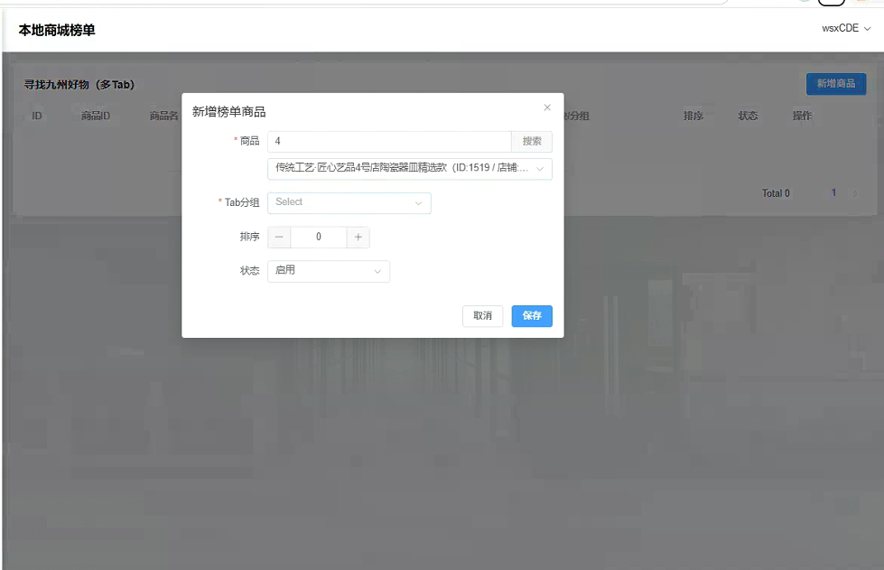
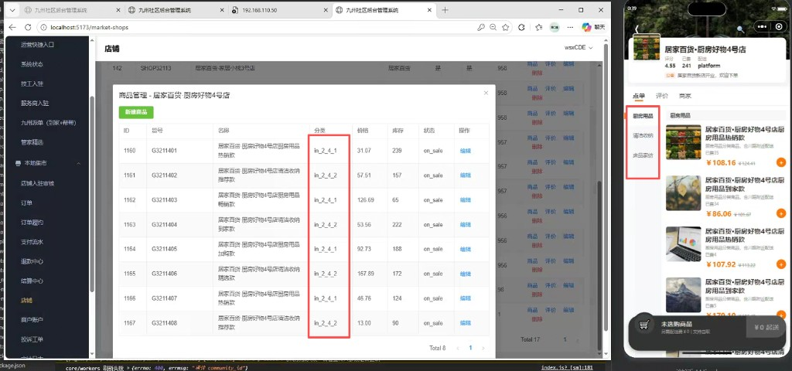

# 微信小程序 Bug 记录文档

## 使用说明
- 本文档仅用于记录 Bug 与回归结果，不修改 `测试.md`。
- 你每次发“问题描述 + 截图（可后补）”，我按模板整理成一条。
- 建议编号格式：`BUG-YYYYMMDD-序号`（示例：`BUG-20260425-001`）。

## 严重级别
- `P0`：核心流程不可用、资金/数据风险、影响面大。
- `P1`：主要流程受阻，影响明显。
- `P2`：功能异常但可继续使用。
- `P3`：显示、文案、体验问题。

## Bug 条目模板（复制新增）
### [BUG-YYYYMMDD-XXX] 标题
- **发现时间**：
- **发现端**：小程序前端 / Web 后台管理 / 后端服务
- **发现角色**：用户 / 商家 / 管理员 / 服务商
- **环境信息**：测试/生产，版本号，设备，系统
- **严重级别**：P0 / P1 / P2 / P3
- **前置条件**：
- **复现步骤**：
  1. 
  2. 
  3. 
- **实际结果**：
- **预期结果**：
- **影响范围**：
- **截图/录屏**：
- **关联模块/接口**：
- **备注**：
- **修复状态**：待修复 / 修复中 / 待回归 / 已关闭
- **回归结果**：通过 / 不通过 / 未回归
- **回归时间**：

---

## Bug 列表

### [BUG-20260426-001] 本地商城“九州好物”新增榜单商品时 Tab 分组无法选择
- **发现时间**：2026-04-26 00:30（UTC+8）
- **发现端**：Web 后台管理
- **发现角色**：管理员
- **环境信息**：后台管理平台（本地商城榜单页面，Windows 10）
- **严重级别**：P1
- **前置条件**：已进入“本地商城榜单”，打开“新增榜单商品”弹窗并已选择商品
- **复现步骤**：
  1. 进入后台管理平台的“本地商城榜单”页面（第十八条：寻找九州好物）。
  2. 点击“新增商品”，在弹窗中选择一个商品。
  3. 点击 `Tab分组` 下拉框，尝试选择分组。
- **实际结果**：`Tab分组` 下拉框无法选择（无可选项/无法生效），导致无法完成正常配置。
- **预期结果**：`Tab分组` 可正常加载并选择分组，允许保存新增榜单商品。
- **影响范围**：后台管理员无法正常维护“九州好物”榜单商品，影响商城内容运营。
- **截图/录屏**：`screenshots/BUG-20260426-001.png`
  
- **关联模块/接口**：本地商城榜单管理、Tab 分组下拉数据源接口（具体接口名待补充）
- **备注**：建议排查 Tab 分组字典/配置是否为空、接口返回字段是否与前端下拉组件映射一致。
- **修复状态**：待修复
- **回归结果**：未回归
- **回归时间**：

### [BUG-20260426-002] 商品管理列表“分类”列显示原始字段值，未显示中文映射名称
- **发现时间**：2026-04-26 00:40（UTC+8）
- **发现端**：Web 后台管理
- **发现角色**：管理员
- **环境信息**：后台管理平台（商品管理页面，Windows 10）
- **严重级别**：P2
- **前置条件**：已进入后台“商品管理”并打开某店铺商品列表
- **复现步骤**：
  1. 进入后台管理平台“商品管理”页面。
  2. 查看商品列表中的“分类”字段。
  3. 对比小程序端展示分类名称。
- **实际结果**：后台“分类”列展示原始分类字段值（如 `n_2_4_1`、`n_2_4_2`），不便于运营识别。
- **预期结果**：后台应展示分类字段映射后的中文名称，与业务可读名称一致。
- **影响范围**：后台商品管理可读性差，可能导致运营误判分类并影响商品维护效率。
- **截图/录屏**：`screenshots/BUG-20260426-002.png`
  
- **关联模块/接口**：商品管理列表、分类字典映射逻辑（前端渲染或后端返回字段）
- **备注**：建议统一“分类编码 -> 中文名称”的映射来源，避免后台与小程序端展示不一致。
- **修复状态**：待修复
- **回归结果**：未回归
- **回归时间**：
